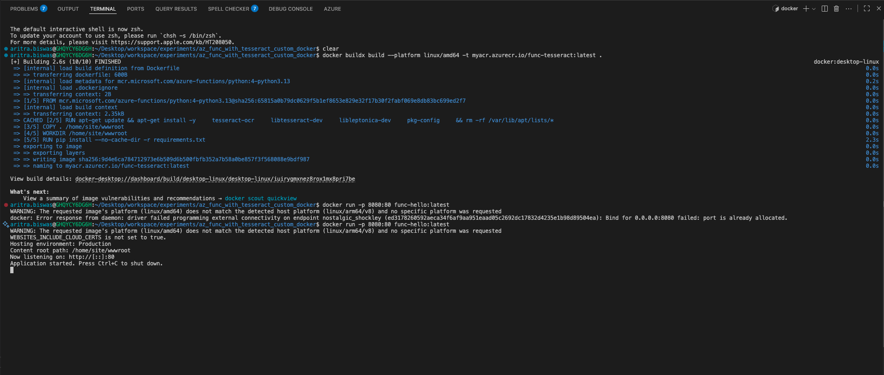
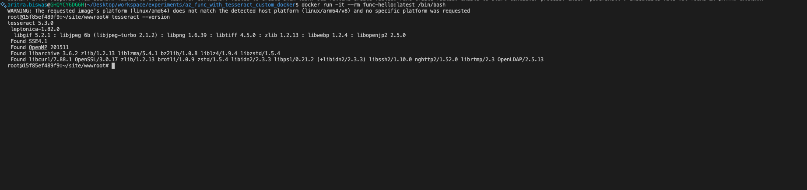

## Running in Mac M1/M2

```bash
docker buildx build --platform linux/amd64 -t myacr.azurecr.io/func-tesseract:latest .
docker run -p 8080:80 func-hello:latest
curl http://localhost:8080/api/HttpExample?name=Aritra
```


```bash
docker run -it --rm func-hello:latest /bin/bash
tesseract --version
```


## Running in Windows

```powershell
docker build --platform linux/amd64 -t myacr.azurecr.io/func-tesseract:latest .
docker run -p 8080:80 func-hello:latest
curl http://localhost:8080/api/HttpExample?name=Aritra
```

```powershell
docker run -it --rm func-hello:latest powershell
tesseract --version
```

## Running in Docker



## Validating Installation inside docker image



